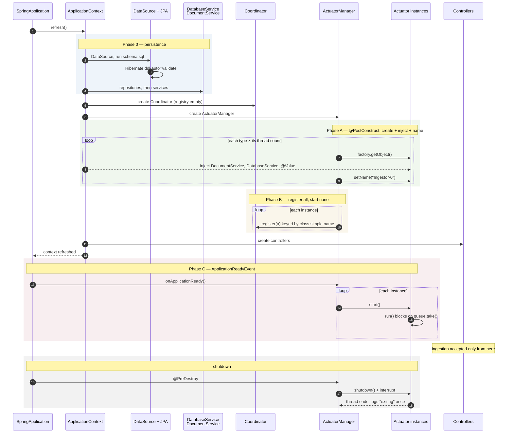

# Startup Sequence

Design behind Story P1.9 (Actuator Instantiation & Registration). Describes the order beans are
created and the point at which actuator threads begin running.

## The constraint

Every actuator must be registered with the Coordinator before any actuator thread starts.

An actuator routes work by name. `Actuator.run()` takes the name returned by `doTheThing` and
calls `Coordinator.get(n)` to find the next stage. If `Ingestor-0` starts processing while
`Extractor` is still being constructed, that lookup returns null and the first document dies in
the routing step, with an NPE that the loop's own catch block swallows.

Creation and starting therefore have to be separate beats. A loop that creates an actuator and
immediately starts it cannot satisfy this, because the actuator is live before its siblings exist.

## Why the current sequence aborts

Each actuator is built twice. `Ingestor`, `Extractor`, `Classifier`, `Indexer` and `Clipper` all
carry `@Component`, so component scan builds one of each. `ActuatorThreadConfig` also declares
`@Bean @Scope("prototype")` factories for four of them, plus array beans that call
`factory.getObject()`, so it builds another.

Both instances reach `Coordinator.register()`:

```java
if (!registry.containsKey(a.getClass())) {   // guard keyed by CLASS
    registry.put(a.getClass(), new ArrayList<>());
    actuator.put(a.getName(), new ArrayList<>());   // map keyed by NAME
}
registry.get(a.getClass()).add(a);
actuator.get(a.getName()).add(a);   // null on the second instance
```

The second instance takes the guard's false branch, so nothing is ever seeded under its name, and
`actuator.get(...)` returns null. The NPE propagates out of the `ingestor` bean factory,
`ingestorActuators` fails, and the context aborts. This is what stops the application starting.

Three further faults sit in the same path:

- `Actuator.java:32` registers before `:33` sets the name, so the routing map is keyed with
  Thread's generated name (`Thread-7`) rather than `Ingestor`. Every routing lookup would miss
  even without the NPE.
- `Actuator.java:40` calls `start()` in the constructor and `ActuatorThreadConfig` calls it again,
  which throws `IllegalThreadStateException`.
- Starting inside the constructor puts the loop live before Spring has injected anything.
  `Actuator.service` carries no annotation at all, so `DocumentService` is never injected and
  `service.setStatus(...)` NPEs on the first message regardless.

## Proposed sequence

One bean owns actuator lifecycle: **`ActuatorManager`**. It holds the `ObjectFactory` for each
actuator type, the configured thread counts, and the `Coordinator`.

`ActuatorThreadConfig` keeps the prototype `@Bean` factories and loses the four `...Actuators`
array beans. `@Component` comes off all five actuator classes. `Actuator`'s constructor sets name,
logger and flags, and does no lifecycle work.



### Phase 0 — persistence

Spring builds the `DataSource`, runs `schema.sql` under `sql.init.mode: always`, and Hibernate
validates the mapping under `ddl-auto: validate`. Repositories, then `DatabaseService` and
`DocumentService`, follow. Nothing actuator-related exists yet.

A failure here should abort startup, which it already does. An actuator with a null
`DocumentService` is worse than no application.

### Phase A — create, inject, name

`ActuatorManager.@PostConstruct` reads each `actuators.threads.<name>` value and calls
`factory.getObject()` that many times. Going through the `ObjectFactory` rather than `new` is what
makes Spring populate the instance, so this is where injection happens.

Each instance is then named `<Class>-<index>` (`Ingestor-0`) for readable logs.

No thread is started in this phase.

### Phase B — register

Every instance registers with the Coordinator, keyed on `a.getClass().getSimpleName()`.

The key is deliberately the class simple name, not the thread name. Thread names carry an index
suffix (`Ingestor-0`) while routing asks for the bare class name (`Ingestor`), so the two must not
share a key. Both maps should be seeded with `computeIfAbsent` so neither depends on the other's
guard, which is the bug that aborts startup today.

Several instances of one class stay correct because they share a static queue: `Coordinator.get`
returning the first registered instance still enqueues work any of them can take.

### Phase C — start

On `ApplicationReadyEvent`, the manager starts each thread exactly once. By this point the context
is fully refreshed, every actuator is injected, and every actuator is registered, so the first
message can route through the whole chain.

Ingestion should be accepted only from here. A document created before Phase C would sit in a
queue nothing is reading.

### Shutdown

`@PreDestroy` calls `shutdown()` on each actuator, which clears `running` and interrupts the
thread, then joins with a bounded timeout. `running` is currently private with no way to clear it,
so nothing can stop an actuator deliberately and nothing waits for in-flight work.

## What each phase fixes

| Phase | Fixes |
|---|---|
| A — one owner creates | Double instantiation; the `IllegalThreadStateException` from two `start()` calls |
| A — name before register | Routing map keyed `Ingestor` rather than `Thread-7` |
| A — inject before start | `service.setStatus()` NPE on the first message |
| B — register all before starting any | `Coordinator.get("Extractor")` returning null mid-chain |
| C — start on ApplicationReadyEvent | Threads running against a half-built context |
| Shutdown | Nothing can currently stop an actuator |

## Configuration changes

- Add `actuators.threads.clipper: 1`. `Clipper` exists and is scanned, but has no thread-count
  entry, so it scales differently from its siblings for no stated reason.
- `actuators.threads.briefing: 1` is configured and nothing reads it — no Briefing class exists in
  `src/main/java`. Remove it, or keep it with a comment marking it reserved for Phase 2.

## Dependency on P1.10

Phase C must not land before P1.10, or alongside it at the latest.

`Actuator.run()` currently polls with `poll()`, dereferences the null it gets from an empty queue,
swallows the NPE in `catch (Throwable)`, and loops again with no back-off. Started as designed
here, this sequence would produce five correctly registered actuators burning five cores. The loop
has to block on `take()` first.

## An unrelated defect found while reading

`Actuator.map` and `Actuator.registry` (`Actuator.java:27-28`) are instance fields, not static:

```java
private final Map<Class<?>, Queue<Message>> map = new HashMap<>();
private final Map<Class<?>, Actuator> registry = new HashMap<>();
```

The base `getQueue()` builds a queue inside that per-instance map, so two instances of the same
class would hold separate queues and horizontal scaling would silently stop working. It is dead
code today because every subclass overrides `getQueue()` with its own `static` queue. It stays
dead only until someone adds a sixth actuator and forgets to override.

P1.10 already calls for removing both fields. Recorded here because the reason is stronger than
"unused": left in place, it is a trap rather than clutter.
