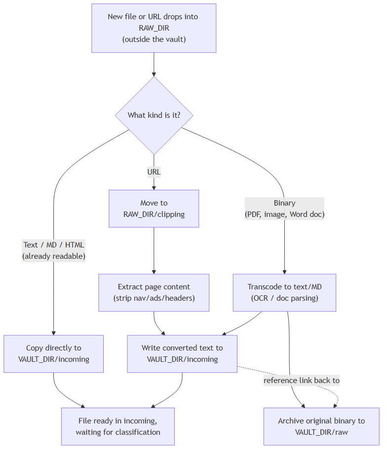
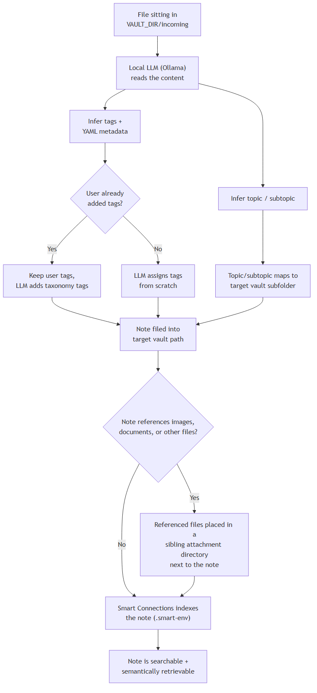

# Ingestion & Classification Flow

Covers EP1 (Story 1.1, Story 1.2) and EP2 (Story 2.1), and the architectural decisions behind them (ADR14, ADR15) in `documets/design/ADRS.md`.

## 1. Ingestion

Everything a user wants captured lands first in `$RAW_DIR`, outside the vault. From there it's routed by type:

- Text, Markdown, and HTML are already indexable, so they're copied straight to `$VAULT_DIR/incoming`.
- URLs are moved to `$RAW_DIR/clipping`, where the page content is extracted before the result joins `$VAULT_DIR/incoming`.
- Binary formats (PDF, images, Word docs) are transcoded into text/MD. The transcoded output goes to `$VAULT_DIR/incoming`; the original binary is archived to `$VAULT_DIR/raw`, and the transcoded file keeps a reference back to that archived original.

Binaries never enter the vault unconverted — they can't be indexed until they're text, so they stay staged until conversion finishes (ADR14).

## 2. Classification

Once a file is sitting in `$VAULT_DIR/incoming`, the local LLM (Ollama) processes it:

- Infers tags and YAML frontmatter metadata, layering on top of (not replacing) any tags the user already added.
- Separately infers a topic and subtopic. The topic/subtopic — not the tags — determines which vault subfolder the note is filed into, since tags are multi-valued and topic/subtopic gives a single deterministic path (ADR15).
- If the note references images, documents, or other files, those referenced files are placed in a sibling attachment directory next to the note, so a note and its attachments move and archive together.
- Once filed, Smart Connections indexes the note into `.smart-env`, making it searchable and semantically retrievable.

## Source diagrams

The rendered PNGs above are generated from Mermaid source files kept alongside them for editing:

- `img/ingestion-flow.mmd`
- `img/classification-flow.mmd`

Regenerate after editing with `npx @mermaid-js/mermaid-cli -i <file>.mmd -o <file>.png -b white`.
