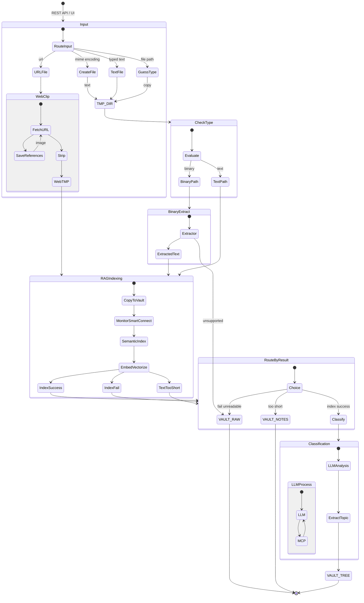

# **Document Ingestion Process Architecture**

## **Overview & Instructions**

This document details the architecture and operational flow of the automated **Document Ingestion Process**.

## **Visual Diagram**


## **Process Steps**

1. **Document Arrival and Evaluation:** The incoming document arrives and its format is evaluated to determine if it is plain text or non-text.  
2. **Indexing Queue:** If the document is plain text, it enters the queue directly for semantic indexing.  
3. **Extraction Processing:** If the document is not plain text (e.g., PDF, HTML, Word, Excel), it undergoes an extraction process to transform its contents into readable text before entering the semantic indexing queue.  
4. **Semantic Indexing & LLM Analysis:** An LLM analyzes the queued text to identify and determine the primary topic and subtopic of the document.  
5. **Tagging:** The LLM generates and appends appropriate metadata tags to the document based on its content analysis.  
6. **Directory Storage Routing:** The document is moved to a target file directory structure organized by its classified topic and subtopic.  
7. **Original File Preservation:** The original untransformed document is preserved and stored as a sibling file alongside the transformed readable text document, ensuring full retrievability of either format.

## **Mermaid State Diagram**

The following diagram describes the full ingestion workflow:



## **UML (PlantUML Source)**

The following is the original PlantUML diagram source:

```
@startuml
state start1  <<start>>
[*] --> startIngestion :  REST API call
    start1 --> startIngestion : UI
state Ingestion {
state startIngestion  <<start>>
   state input {
    startIngestion --> inp
    state inp <<expansionInput>>
     state "TMP_DIR file" as tmp <<outputPin>>
    inp --> urlFile : url
    inp --> download : mime encodin
    inp --> textFile : typed text
	inp --> Guess : file path
	Guess --> tmp : copy
    state "Create File" as download
    download : mime type and \nfilename from request
    download --> validText
    state "TXT MD " as Guess
    Guess: Guess mimetype by\n file extension and contents
    state validText <<choice>>
    validText --> tmp : text
    validText --> binary : binary

    state "JSON" as urlFile
    urlFile : { url,date }
     state "TXT" as textFile
     textFile: create text file
    textFile -> tmp
    urlFile --> fetch
   }
   state "Web Clipp" as  clip {
      state "Fetch URL" as  fetch
      fetch --> references
      references --> fetch : image
      fetch --> strip
      strip --> webfile
     state "TMP_DIR" as webfile <<Outputpin>>
   }
   state "Extract" as  extract {
     state "Binary" as binary  <<inputpin>>
     state "Text" as extracted  <<outputpin>>
     binary --> extractor
     extractor --> extracted
     extractor -->VAULT_RAW: unsupported file type
   }
   webfile --> inFile
   tmp --> inFile
   state "RAG Indexing" as Incomming {
     state "Text File" as inFile  <<inputpin>>
        Incomming: copy file to VAULT_INCOMING
        Incomming: monitor smart-connect
        inFile --> VAULT_INCOMMING
      VAULT_INCOMMING --> RAG
      RAG: smart-connect
      RAG: semantic index
      RAG: embed , vertorized
      RAG --> success
      RAG --> fail
      RAG --> tooShort
     state success <<Outputpin>>
     state "Fail Binary" as fail <<Outputpin>>
     state "Text too short" as tooShort <<Outputpin>>
}
   state VAULT {
     state VAULT_RAW
     state VAULT_TREE
     state VAULT_NOTES
   }
   state indexStatus <<choice>>
   success --> Classify : index success
   tooShort --> VAULT_NOTES 
   VAULT_NOTES : fail short text
   fail --> VAULT_RAW : fail unleggible document
   VAULT_RAW : file type cannot be embedded
   
   state Classify {
     Classify : better when all documents are indexed
     [*] --> LLM 
     state LLM {
        LLM --> MCP
        MCP -->LLM
     }
     LLM --> topic
     state topic <<Outputpin>>
   }
   topic --> VAULT_TREE 
   VAULT_TREE : folder in vaul \n is topic/subtopic
   
   indexStatus --> VA : indexed 
@enduml
```
