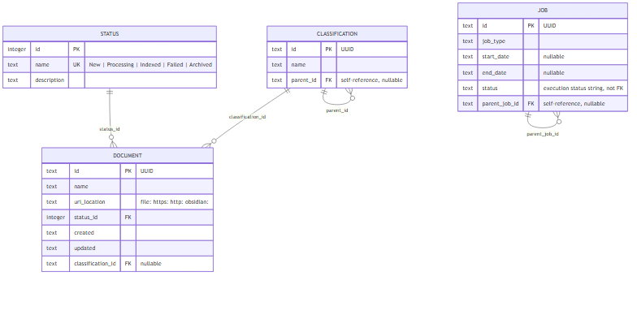

# Database Schema — Document / Status / Classification / Job

**SUPERSEDED:** This file predates Story 12.2's schema redesign. The current schema in `documets/design/schema.sql` includes 9 tables: Document, Status, Job, JobStatus, JobType, Tag, DocumentTag, JobFile, and Classification (Story 12.2 removed Process and JobDocument, added Tag/DocumentTag/JobFile/JobStatus). See `documets/design/classes.mmd`/`classes.png` for the current ERD, and `documets/design/classes.md` for the domain model.

---

Physical SQLite translation of the domain model in `documets/design/classes.md` (Story 12.1, EP12; see ADR17 for the technology choice). Design only — no implementation in `server/` yet.

## Scope

Covers exactly the four entities in `classes.md`: Document, Status, Classification, Job. The open Tag/Topic-vs-Classification gap noted in `classes.md`'s "Open question" section is **not** addressed here — deferred to a later pass.

## Why a separate database

The vault (Markdown files) stores note *content*. `.smart-env` (Smart Connections) stores *embeddings*. Neither is a good fit for structured, relational, queryable metadata — document lifecycle status, hierarchical classification, or a job queue with parent/child jobs. This schema fills that gap.

## Tables

### `status`

Fixed enumeration — New, Processing, Indexed, Failed, Archived (per `classes.md`). Small and rarely changes, so it's seeded once rather than managed dynamically.

| Column | Type | Constraints | Notes |
| --- | --- | --- | --- |
| `id` | INTEGER | PRIMARY KEY | Sequential, matches `classes.md`'s "Integer" type |
| `name` | TEXT | NOT NULL, UNIQUE | New / Processing / Indexed / Failed / Archived |
| `description` | TEXT | | Human-readable detail |

### `classification`

Self-referencing hierarchy (topic/subtopic), per ADR15.

| Column | Type | Constraints | Notes |
| --- | --- | --- | --- |
| `id` | TEXT | PRIMARY KEY | UUID string (SQLite has no native UUID type) |
| `name` | TEXT | NOT NULL | |
| `parent_id` | TEXT | REFERENCES `classification(id)`, NULL | NULL = top-level (topic); non-null = subtopic |

### `document`

| Column | Type | Constraints | Notes |
| --- | --- | --- | --- |
| `id` | TEXT | PRIMARY KEY | UUID string |
| `name` | TEXT | NOT NULL | |
| `uri_location` | TEXT | NOT NULL | `file:`, `https:`, `http:`, or `obsidian:` URI |
| `status_id` | INTEGER | NOT NULL, REFERENCES `status(id)` | |
| `created` | TEXT | NOT NULL, default now | ISO-8601 UTC |
| `updated` | TEXT | NOT NULL, default now | ISO-8601 UTC |
| `classification_id` | TEXT | REFERENCES `classification(id)`, NULL | NULL until classified |

### `job`

| Column | Type | Constraints | Notes |
| --- | --- | --- | --- |
| `id` | TEXT | PRIMARY KEY | UUID string |
| `job_type` | TEXT | NOT NULL | e.g. `ingest`, `transcode`, `classify`, `batch-run` |
| `start_date` | TEXT | NULL | ISO-8601 UTC, set when the job starts |
| `end_date` | TEXT | NULL | ISO-8601 UTC, set when the job finishes |
| `status` | TEXT | NOT NULL | Execution status string (job lifecycle — e.g. Queued/Running/Completed/Failed). Deliberately **not** a foreign key into `status`: that table enumerates *document* lifecycle states, a different value set from job execution states. Keeping them separate avoids conflating the two. |
| `parent_job_id` | TEXT | REFERENCES `job(id)`, NULL | Sub-job hierarchy (e.g. a batch run's child jobs) |

## DDL

```sql
CREATE TABLE status (
  id INTEGER PRIMARY KEY,
  name TEXT NOT NULL UNIQUE,
  description TEXT
);

CREATE TABLE classification (
  id TEXT PRIMARY KEY,
  name TEXT NOT NULL,
  parent_id TEXT REFERENCES classification(id)
);

CREATE TABLE document (
  id TEXT PRIMARY KEY,
  name TEXT NOT NULL,
  uri_location TEXT NOT NULL,
  status_id INTEGER NOT NULL REFERENCES status(id),
  created TEXT NOT NULL DEFAULT (strftime('%Y-%m-%dT%H:%M:%fZ', 'now')),
  updated TEXT NOT NULL DEFAULT (strftime('%Y-%m-%dT%H:%M:%fZ', 'now')),
  classification_id TEXT REFERENCES classification(id)
);

CREATE TABLE job (
  id TEXT PRIMARY KEY,
  job_type TEXT NOT NULL,
  start_date TEXT,
  end_date TEXT,
  status TEXT NOT NULL,
  parent_job_id TEXT REFERENCES job(id)
);

CREATE INDEX idx_document_status ON document(status_id);
CREATE INDEX idx_document_classification ON document(classification_id);
CREATE INDEX idx_classification_parent ON classification(parent_id);
CREATE INDEX idx_job_parent ON job(parent_job_id);
CREATE INDEX idx_job_type_status ON job(job_type, status);

INSERT INTO status (id, name, description) VALUES
  (1, 'New', 'Document captured but not yet processed.'),
  (2, 'Processing', 'Document is being sanitized, transcoded, or classified.'),
  (3, 'Indexed', 'Document has been filed into the vault and indexed for search.'),
  (4, 'Failed', 'Processing failed and requires attention.'),
  (5, 'Archived', 'Document processing complete and no longer active.');
```

## Storage location and access

- Single-file SQLite database, proposed path: sibling to `vault_dir`/`raw_dir` (same parent folder), e.g. `C:\Users\rsant\desar\Local Vault\4thbrain-metadata.db` — outside both the git repo and the Obsidian vault itself, matching the pattern already established for `raw_dir` in `params.json`/ADR14. A `metadata_db_path` key would be added to `params.json` when this is actually wired in (not done in this pass).
- Access from `server/` via `better-sqlite3` (synchronous, simplest fit for a single-process local server) or Node's built-in `node:sqlite` — no new server process, no network port, consistent with ADR5/ADR17.
- UUIDs are generated application-side (`crypto.randomUUID()` in Node) and stored as `TEXT`; SQLite has no native UUID type.
- Timestamps stored as ISO-8601 `TEXT` rather than Unix-epoch integers, matching the project's general human-readability bias (Markdown vault, JSON configs) — the trade-off is slightly less compact storage, acceptable at this scale.

## ERD



Source: `documets/img/database-schema.mmd`.
